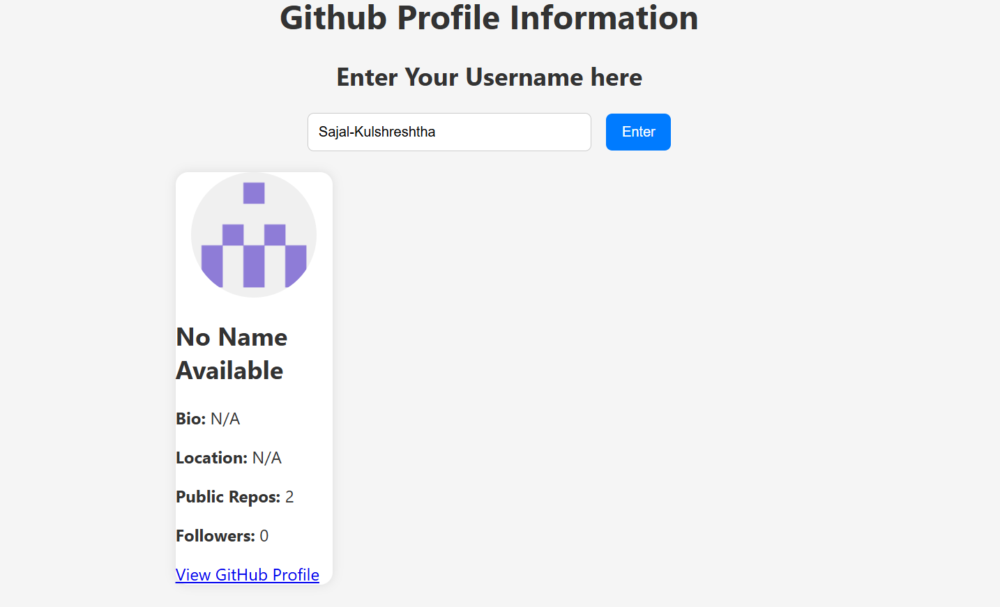

# 👤 GitHub Profile Viewer

A simple and interactive web app that allows users to fetch and view public profile information of any GitHub user using their username. Built with HTML, CSS, JavaScript, and the GitHub REST API.

---

## ✨ Features

- 🔍 Search any GitHub user by username
- 🧾 View user details including:
  - Name
  - Bio
  - Location
  - Public Repositories
  - Followers
  - Avatar
- 🚫 Graceful error handling for invalid or empty input
- 💡 Clean, responsive design with smooth fade-in animation
- ⚙️ Powered by GitHub's REST API

---

## 🌐 Live Demo

You can try the app live here: https://sajal-kulshreshtha.github.io/Github-Profile-Viewer/

---

## 📸 Screenshot

---
